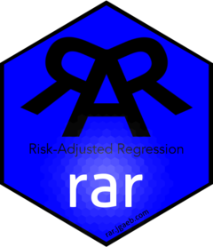

<!-- README.md is generated from README.Rmd. Please edit that file -->

# rar <a href="https://rar.jgaeb.com"></a>

<!-- badges: start -->

[](https://CRAN.R-project.org/package=rar)
[](https://app.codecov.io/gh/jgaeb/rar?branch=main)
[](https://github.com/jgaeb/rar/actions/workflows/R-CMD-check.yaml)
<!-- badges: end -->

Quantitative studies of disparate impact face two key challenges:

1.  ***Omitted*-variable bias** occurs when an analyst omits relevant
    variables, like a job applicant’s work history, in their regression
    model.
2.  ***Included*-variable bias** occurs when a researcher includes
    variables in their regression model that are not relevant to the
    outcome of interest, like a job applicant’s height. These variables
    can mask the relevance of gender, race, or other protected
    attributes.

The `rar` package supports risk-adjusted regression, a framework for
mitigating included-variable bias. It computes risk-adjusted disparities
and performs an interpretable sensitivity analysis that can be used to
assess the robustness of regression results to omitted-variable bias.
See [“Mitigating Included- and Omitted-Variable Bias in Estimates of
Disparate”](https://arxiv.org/abs/1809.05651) for more details.

## Installation

You can install the latest stable release of `rar` from CRAN with:

``` r
install.packages("rar")
```

You can install the development version of `rar` from
[GitHub](https://github.com/) with:

``` r
# install.packages("devtools")
devtools::install_github("jgaeb/rar")
```

## Example

To perform risk-adjusted regression, use the `sens()` function.

``` r
library(rar)

# Generate some data
set.seed(1)
df <- tibble::tibble(
  group = factor(
    sample(c("a", "b"), 1000, replace = TRUE),
    levels = c("a", "b")
  ),
  p = runif(1000)^2,
  frisked = runif(1000) < p + 0.1 * (group != "a")
)

# Compute risk-adjusted regression coefficients and perform sensitivity analysis
sens(df, group, frisked, p, "a", 0.1, eta = 0.001, m = 10)
#> # A tibble: 10 × 3
#>    epsilon beta_min_b beta_max_b
#>      <dbl>      <dbl>      <dbl>
#>  1  0          0.102       0.102
#>  2  0.0111     0.0752      0.125
#>  3  0.0222     0.0472      0.151
#>  4  0.0333     0.0185      0.178
#>  5  0.0444    -0.0106      0.207
#>  6  0.0556    -0.0394      0.236
#>  7  0.0667    -0.0677      0.265
#>  8  0.0778    -0.0950      0.295
#>  9  0.0889    -0.123       0.324
#> 10  0.1       -0.151       0.354
```
